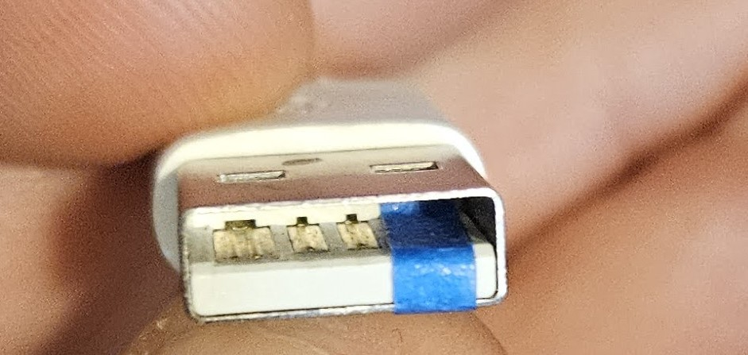
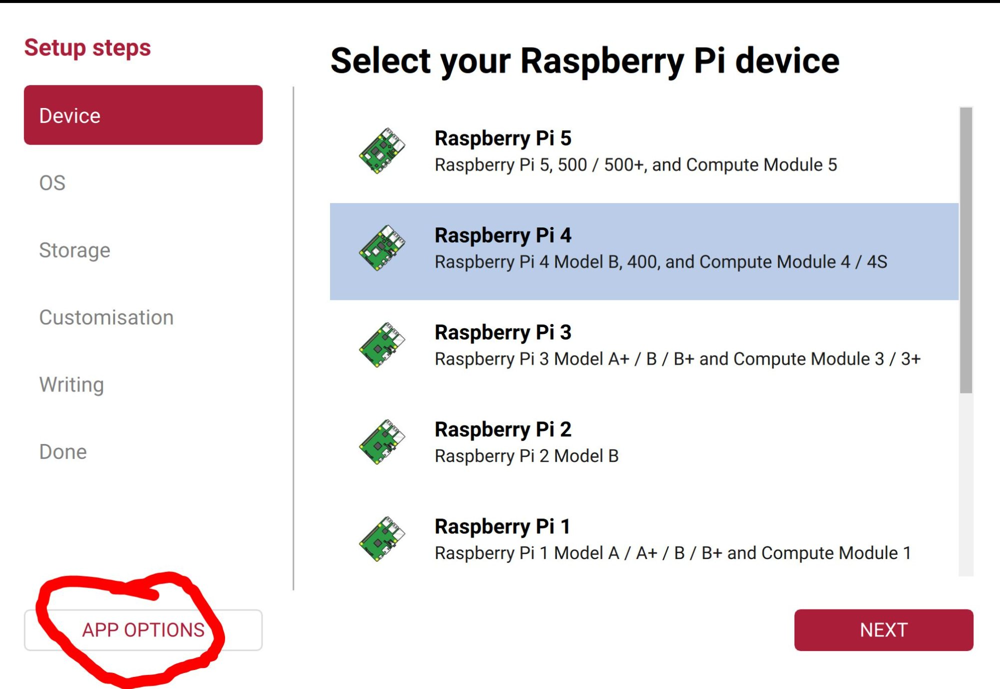

# The Complete OctoPrint + Obico Setup Guide for Prusa Core One

**Raspberry Pi 4B · OctoPi 64-bit · go2rtc · Obico AI Failure Detection**

*A step-by-step guide to building a fully monitored, remotely accessible, production-ready print server for the Prusa Core One. Every step includes context on what it does and why it matters.*

> **How this guide was built:** This entire setup — every SSH command, service file, config block, and troubleshooting fix — was developed interactively with Claude Opus. I planned, tested, verified, and looked up everything extensively before committing each change. If you run into issues not covered here, see the **Troubleshooting with AI Assistance** section below — it includes a ready-to-paste prompt that equips Claude with full context about this system.

---

### Placeholders Used in This Guide

SSH blocks throughout this guide use these placeholders. Replace them with your actual values:

| Placeholder | What It Is | Where It's Used |
|---|---|---|
| `YOUR_USERNAME` | The SSH/Pi username you set during flashing | Everywhere (paths, services, scripts) |
| `YOUR_PI_IP` | Your Pi's static IP address | OctoPrint URLs, PrusaSlicer, browser access |
| `YOUR_CAMERA_IP` | Your Buddy camera's static IP address | go2rtc config (Section 6) |
| `YOUR_API_KEY` | OctoPrint's global API key | Validation scripts, backups (Section 7 onwards) |
| `YOUR_WINDOWS_IP` | Your Windows PC's IP *(optional)* | Backup push to Windows (Section 12 only) |
| `YOUR_WIN_USER` | Your Windows username *(optional)* | Backup push to Windows (Section 12 only) |

> **Time-saving tip:** Copy this entire guide into a text editor (Notepad, VS Code, etc.) and use **Find & Replace** to swap all placeholders with your actual values in one go. Then you can copy-paste each SSH block directly without editing every time.

> **⚠️ The #1 cause of setup failures is a missed or mistyped placeholder.** If even one `YOUR_USERNAME` is left unchanged inside a service file, that service silently fails on boot with no obvious error. Treat these like the screw types on the Core One build — get one wrong and things don't work, and you won't immediately know why. Use Find & Replace, and double-check before pasting.

---

## What You'll End Up With

**Core setup:**
- OctoPrint controlling your Core One over USB at 230400 baud
- PrusaSlicer direct upload with thumbnails
- G-code scripts for proper pause/resume/cancel behavior (M601/M602/M603)
- Low-latency serial communication for smooth CoreXY printing
- Everything auto-starts on boot

**With camera + AI monitoring (recommended):**
- Live 1080p MJPEG camera feed with ~0.2-second snapshots
- Obico AI failure detection with auto-pause on spaghetti/blob-of-death
- Remote monitoring from your phone via the Obico app

**With system hardening (recommended):**
- SD card protection (zram swap, tmpfs logs, reduced writes)
- Persistent journald for crash diagnosis
- OctoPrint log rotation to prevent disk fill

**Optional extras:**
- Automated tiered backups pushed to a Windows PC over SMB
- GPIO fan control with configurable threshold
- Delayed print scheduling via the `at` command
- Bed drop after print completes for easy part removal

---

## Hardware Requirements

> **Supporting this guide:** The product links below are affiliate/referral links. Using them supports the continued maintenance of this guide at no extra cost to you. If you found this guide helpful, it's an easy way to say thanks. You can also support directly at [ko-fi.com/3dzoidberg](https://ko-fi.com/3dzoidberg).

| Component | Specification | Notes |
|---|---|---|
| Raspberry Pi | 4B, 2GB+ RAM | 2GB works but is tight; 4GB is more comfortable |
| SD Card | 32GB+ endurance-rated | High-endurance cards are essential — standard cards wear out fast |
| USB Cable | USB-A to USB-C | **Tape the 5V pin** on the USB-A end to prevent backpowering |
| Camera | Prusa Buddy Wi-Fi camera | Or any RTSP-capable IP camera |
| Power Supply | Official Pi 4 PSU (5.1V 3A) | Undervoltage will cause random crashes and SD corruption |
| Case + Cooling | Any Pi case with passive or active cooling | A case with a fan kit is more cost-effective than buying parts separately |
| Fan (optional) | 5V GPIO-controlled fan | For on/off temperature control — included in most case kits |

### Recommended Products

**Raspberry Pi:** This setup runs flawlessly on a Pi 4B — it's the board I use daily with OctoPrint, go2rtc, and Obico all running simultaneously without issues. A Pi 5 is overkill for this but works great if you plan to use it for other things too. I recommend buying from the official Raspberry Pi store on Amazon when possible.

- [Raspberry Pi 4B — Official Raspberry Pi Store](https://amzn.to/4lPTDxY) — the board by itself, if you already have a case and power supply
- [Raspberry Pi 4B — CanaKit Starter Kit](https://amzn.to/4rPVxjw) — includes case, power supply, and heatsinks
- [Raspberry Pi 5 — CanaKit Kit with Cooler, Case & Official Charger](https://amzn.to/4bpTH3M) — if you want the latest Pi with everything included

I also have a cooling fan on my Pi but it's honestly not needed — the Pi 4B runs comfortably in the 50-55°C range with this workload, well below the 80°C throttle point. That said, I found that ordering a kit with a case, fan, and power supply bundled together is more cost-effective than buying them separately. You can also 3D print your own Pi case, but by the time you factor in the fan and power supply you haven't saved much.

**SD Card:** Use a **high-endurance** card, not a regular one. Standard SD cards are designed for cameras and phones — lots of reads, few writes. OctoPrint generates constant writes (logs, state files, plugin data). High-endurance cards are rated for continuous write workloads and last dramatically longer.

- [SanDisk 64GB High Endurance — Official SanDisk Store](https://amzn.to/4rIxiU9) — 64GB is more than enough and gives comfortable headroom for backups and timelapse files

### USB Cable Important Note

The Core One's xBuddy board can be backpowered through USB. If you don't tape over the 5V line, the Pi's USB port supplies power to the printer's controller board through the data cable. This causes erratic behavior — random disconnects, brownouts, and phantom serial errors that are extremely hard to diagnose.

**Tape the 5V pin** (pin 1, the leftmost pin when looking at the USB-A connector with the flat side up) with electrical tape or Kapton tape. This blocks power delivery while keeping the data lines intact.

**Plug into the Pi's USB 2.0 port** (black connector), not the USB 3.0 (blue connector). The Pi 4 has 2 of each. USB 2.0 has more than enough bandwidth for serial at 230400 baud and is the safer choice — less electrical noise and avoids the known USB 3.0 interference with 2.4GHz Wi-Fi (which matters if your Buddy camera is on Wi-Fi). USB-C end goes into the Core One.



---

# Phase 1: Foundation

*Flash the OS, set up networking, verify the Pi boots correctly.*

## Section 1: Flash OctoPi (64-bit)

The default OctoPi image offered in Raspberry Pi Imager is **32-bit**. For a Pi 4 or Pi 5, the **64-bit version** performs significantly better — OctoPrint, Python, and ffmpeg all benefit from the aarch64 instruction set. This guide assumes 64-bit throughout.

**1.** Download and install [Raspberry Pi Imager](https://www.raspberrypi.com/software/)

**2.** Open Imager and click **APP OPTIONS** (bottom-left corner of the Device selection screen):



**3.** In App Options, find **Custom image repositories** and add this URL:
```
http://unofficialpi.org/rpi-imager/rpi-imager-octopi.json
```

This adds the community-maintained 64-bit OctoPi builds to Imager's OS list. Without this, you only see the 32-bit version.

**4.** Go back and continue the setup:
- **Device:** Select your Pi model (e.g., Raspberry Pi 4)
- **OS:** You should now see OctoPi with 64-bit options — select the **latest stable 64-bit version**
- **Storage:** Select your SD card

**5.** Go to **Customisation** and configure:
- Set hostname (e.g., `octopi` — or whatever you want, just be consistent)
- Set username and password — **remember these, every path and service file depends on your username**
- Configure Wi-Fi (SSID and password) — can skip if using a LAN cable
- Enable SSH with password authentication

> **Critical lesson from previous setups:** Your username is NOT `pi`. Every online guide assumes `/home/pi/` — mentally replace that with `/home/YOUR_USERNAME/` everywhere. Service files, paths, and scripts all depend on getting this right.

**6.** Click **Write** and wait for it to finish

**7.** Insert SD card into Pi, connect USB to printer, power on. Wait 2–3 minutes for first boot to complete.

---

## Section 2: Router & Camera Configuration

Before SSH-ing into the Pi, set up a static IP for the Pi in your router. This prevents the IP from changing on reboot, which would break scripts and bookmarks.

1. Log into your router admin panel
2. Find the Pi's MAC address (it should appear after first boot) and assign a **static IP** (e.g., `192.168.0.181`)
3. If using a Buddy Wi-Fi camera, assign it a static IP too (e.g., `192.168.0.167`)
4. Note the IPs — you'll need them throughout this guide

Set static IPs **in the router**, not on the devices themselves. Router-side DHCP reservations survive device reflashes and SD card replacements.

### Enable RTSP on the Buddy Camera *(skip if using a USB camera or no camera)*

The Buddy camera's RTSP stream is **off by default**. Without enabling it, go2rtc won't be able to connect to the camera.

**📱 In the Prusa App** on your phone:
1. Tap your printer → **Camera** tab
2. Tap the camera to open it, then tap the **settings cogwheel**
3. Scroll down and toggle **ON** "RTSP stream on local network"
4. Note the camera IP shown below the toggle — this is `YOUR_CAMERA_IP`

You can verify it works by opening `rtsp://YOUR_CAMERA_IP/live` in VLC on your PC. If you see a live feed, the stream is working.

> **🔌 Using a USB camera (e.g., Logitech C920)?** You don't need a camera IP, RTSP, or any of the above. Just plug the camera into the Pi's USB port. OctoPi detects USB cameras automatically and starts streaming via `webcamd`. Your camera will just work when you boot — no configuration needed. Skip to Section 3, and later skip Sections 5 and 6 entirely.

---

## Section 3: First Boot Verification

SSH into your Pi. On Windows, [PuTTY](https://www.chiark.greenend.org.uk/~sgtatham/putty/latest.html) is the recommended SSH client. Connect to your Pi's static IP with the username you configured during flashing.

On Mac/Linux, use the built-in terminal:
```bash
ssh your_username@your_pi_ip
```

> **PuTTY paste tip:** When pasting SSH blocks from this guide into PuTTY, paste the entire block in one quick action (right-click in the PuTTY window). Don't paste line by line or paste slowly — PuTTY can truncate multi-line heredoc blocks if the paste is interrupted, leaving bash in a broken state waiting for input (you'll see a `>` prompt). If that happens, press Ctrl+C to cancel and try pasting again.

Run this verification block to confirm everything is working:

**⌨️ Paste into SSH:**

```bash
echo "=== SYSTEM INFO ==="
hostname
whoami
cat /etc/os-release | grep PRETTY_NAME
uname -m
free -h | head -2
df -h / | tail -1
vcgencmd measure_temp
vcgencmd get_throttled
echo ""
echo "=== OCTOPRINT ==="
systemctl is-active octoprint
echo ""
echo "=== USB DEVICES ==="
lsusb
echo ""
echo "=== CAMERA SERVICES ==="
for svc in webcamd camera-streamer ffmpeg_hls streamer_select; do
  printf "%-20s %s\n" "$svc:" "$(systemctl is-active $svc 2>/dev/null || echo 'not found')"
done
echo ""
echo "=== IP ADDRESSES ==="
ip -4 addr show | grep "inet " | awk '{print $NF, $2}'
echo ""
echo "=== PI MODEL ==="
cat /proc/device-tree/model && echo
```

**✅ Verify before moving on:**

- **OS** is Debian 12 bookworm, `aarch64` (not `armv7l` — that means you flashed 32-bit)
- **OctoPrint** service is active
- **Throttle** is `0x0` — anything else means undervoltage. Replace your power supply before continuing; an unstable power supply will cause random crashes, SD corruption, and hours of wasted debugging
- **Your printer** appears in `lsusb` as something like `ID 2c99:001f Prusa Original Prusa COREONE`
- **IP address** matches what you configured in your router
- **Pi model** confirms your hardware (e.g., Raspberry Pi 4 Model B Rev 1.5)
- **Camera services** — note which are running. If using a Buddy Wi-Fi camera, we'll disable these in Section 5 and replace them with go2rtc. If using a USB camera, leave them running — `webcamd` is your camera stack.

---

# Phase 2: System Hardening

*Protect the SD card, optimize memory, disable conflicting services.*

## Section 4: OS Hardening *(Recommended)*

This section protects the SD card from premature wear and configures memory management. SD cards have limited write cycles — OctoPrint generates constant log writes, and the default swap file hammers the card. Skipping this won't break anything immediately, but your SD card will wear out significantly faster and you'll have no crash logs to diagnose problems.

### 4.1: Disable SD Card Swap

The default `dphys-swapfile` creates a swap file on the SD card. Every page swap is a write cycle on flash storage. We'll replace it with compressed RAM swap (zram) in the next step.

**⌨️ Paste into SSH:**
```bash
sudo dphys-swapfile swapoff
sudo systemctl disable dphys-swapfile
sudo systemctl mask dphys-swapfile
```

`mask` prevents the service from being accidentally re-enabled. `disable` alone isn't enough — some system updates can re-enable disabled services.

### 4.2: Create zram Swap

zram creates a compressed swap device in RAM. It's much faster than SD swap (RAM access vs. flash I/O) and generates zero card wear. The lz4 compression algorithm is lightweight and typically achieves 2:1 compression, so 512MB of zram effectively gives you ~1GB of usable swap.

**⌨️ Paste into SSH:**
```bash
sudo tee /etc/systemd/system/zram-swap.service > /dev/null << 'ENDZRAM'
[Unit]
Description=Configure zram swap device
After=local-fs.target

[Service]
Type=oneshot
RemainAfterExit=yes
ExecStart=/bin/bash -c '\
  modprobe zram && \
  echo lz4 > /sys/block/zram0/comp_algorithm && \
  echo 512M > /sys/block/zram0/disksize && \
  mkswap /dev/zram0 && \
  swapon -p 100 /dev/zram0'
ExecStop=/bin/bash -c '\
  swapoff /dev/zram0 || true && \
  echo 1 > /sys/block/zram0/reset'

[Install]
WantedBy=multi-user.target
ENDZRAM

sudo systemctl daemon-reload
sudo systemctl enable --now zram-swap.service
```

The `swapon -p 100` sets high priority so the kernel prefers zram over any other swap device.

### 4.3: Fstab Tweaks

These mount options reduce how often the kernel flushes data to the SD card.

**⌨️ Paste into SSH:**
```bash
# noatime: don't update file access timestamps on every read (huge write reduction)
# commit=900: flush filesystem journal every 15 minutes instead of every 5 seconds
# OctoPi may already have noatime set. These commands handle both cases.
if grep -q 'commit=900' /etc/fstab; then
  echo "commit=900 already present"
elif grep -q 'noatime' /etc/fstab; then
  sudo sed -i 's|defaults,noatime|defaults,noatime,commit=900|' /etc/fstab
  echo "Added commit=900 to existing noatime"
else
  sudo sed -i 's|\( / .*defaults\)|\1,noatime,commit=900|' /etc/fstab
  echo "Added noatime and commit=900"
fi

# Put /var/log on tmpfs (50MB in RAM)
# This means log files reset on reboot — that's fine because we use
# persistent journald (next step) for crash diagnosis.
if grep -q '/var/log.*tmpfs' /etc/fstab; then
  echo "/var/log tmpfs already configured"
else
  echo "tmpfs /var/log tmpfs defaults,noatime,nosuid,nodev,noexec,mode=0755,size=50M 0 0" | sudo tee -a /etc/fstab
fi

# Run filesystem check on every boot to catch corruption early
sudo tune2fs -c 1 /dev/mmcblk0p2
```

### 4.4: Persistent Journald with Size Limits

By default, journald stores logs in volatile memory (lost on reboot). We want logs to survive reboots so you can diagnose crashes after the fact, but we cap the size to prevent the journal from eating up SD card space.

**⌨️ Paste into SSH:**

```bash
sudo mkdir -p /etc/systemd/journald.conf.d
sudo tee /etc/systemd/journald.conf.d/size-limit.conf > /dev/null << 'ENDJOURNAL'
[Journal]
Storage=persistent
SystemMaxUse=50M
SystemKeepFree=100M
MaxFileSec=1week
ENDJOURNAL
sudo mkdir -p /var/log/journal
sudo systemd-tmpfiles --create --prefix /var/log/journal
sudo systemctl restart systemd-journald
```

`Storage=persistent` saves logs to disk. `SystemMaxUse=50M` caps total journal size. `MaxFileSec=1week` rotates individual journal files weekly. This combination gives you about a week of crash history in 50MB — enough to diagnose any problem without filling the card.

### 4.5: OctoPrint Log Rotation

OctoPrint writes its own log file outside of journald. Without rotation, `octoprint.log` can grow to hundreds of megabytes during long prints.

**⌨️ Paste into SSH:**
> ⚠️ **1 placeholder to replace:** `YOUR_USERNAME`

```bash
sudo tee /etc/logrotate.d/octoprint > /dev/null << 'ENDLOGROTATE'
/home/YOUR_USERNAME/.octoprint/logs/octoprint.log {
    daily
    rotate 3
    compress
    delaycompress
    missingok
    notifempty
    copytruncate
    size 10M
}
ENDLOGROTATE
```

Replace `YOUR_USERNAME` with your actual username. `copytruncate` allows rotation without restarting OctoPrint. `size 10M` triggers rotation when the file hits 10MB, keeping a maximum of 3 compressed backups.

---

## Section 5: Disable Default Camera Services *(Buddy Wi-Fi camera only)*

OctoPi ships with webcamd, camera-streamer, and other streaming services that expect a USB webcam. We replace them all with go2rtc, which bridges your Buddy camera's RTSP stream to OctoPrint-compatible MJPEG. Leaving the old services running causes port conflicts and confusing errors.

**Skip Sections 5–6 if you don't have a camera.**

> **🔌 USB camera users: skip Sections 5 and 6 entirely.** OctoPi's default camera stack (`webcamd`) IS your camera pipeline — disabling it would kill your feed. Continue directly to Section 7.

**⌨️ Paste into SSH:**
```bash
for svc in webcamd camera-streamer ffmpeg_hls streamer_select; do
  sudo systemctl stop "$svc" 2>/dev/null
  sudo systemctl disable "$svc" 2>/dev/null
  sudo systemctl mask "$svc" 2>/dev/null
done

# Disable OctoPi's camera autostart config
# OctoPi stores camera settings in octopi.txt on the boot partition.
# The location varies between OctoPi versions.
OCTOPI_CONF="/boot/firmware/octopi.txt"
[ ! -f "$OCTOPI_CONF" ] && OCTOPI_CONF="/boot/octopi.txt"
if [ -f "$OCTOPI_CONF" ]; then
  sudo sed -i 's/^camera_usb_options/#camera_usb_options/' "$OCTOPI_CONF"
  sudo sed -i 's/^camera_http_options/#camera_http_options/' "$OCTOPI_CONF"
  sudo sed -i 's/^camera_auto_start/#camera_auto_start/' "$OCTOPI_CONF"
fi
```

`mask` is stronger than `disable` — it creates a symlink to `/dev/null` so the service can't be started even manually. This prevents camera services from respawning after system updates.

> **Watch for respawning services:** Leftover camera services can keep respawning ffmpeg processes on random ports (8080, 8888), consuming CPU and conflicting with go2rtc. If you ever see unexpected ffmpeg processes, check `systemctl list-units --type=service --all | grep -iE "webcam|camera|stream|ffmpeg"` to find the culprit.

---

# Phase 3: Camera Pipeline

*Set up the RTSP-to-MJPEG bridge for live viewing and AI snapshot detection.*

## Section 6: Install go2rtc + Camera Pipeline *(Buddy Wi-Fi camera only)*

go2rtc is the bridge between your camera's RTSP stream and everything that needs camera data. The Buddy camera outputs H.264 over RTSP. OctoPrint needs MJPEG for its live view. Obico needs JPEG snapshots for AI analysis. go2rtc handles all of this with a single binary — no plugins, no complex ffmpeg scripts, no manual process management.

### 6.1: Install go2rtc

**⌨️ Paste into SSH:**
> ⚠️ **1 placeholder to replace:** `YOUR_USERNAME`

```bash
cd /home/YOUR_USERNAME
# For Pi 4/5 (64-bit): use arm64. For Pi 3 or 32-bit OS: use armv6 instead.
curl -L -o go2rtc https://github.com/AlexxIT/go2rtc/releases/download/v1.9.9/go2rtc_linux_arm64
chmod +x go2rtc
./go2rtc --version
```

go2rtc is a single static binary — no dependencies, no package manager, no Python. It runs standalone and manages its own ffmpeg subprocess for the RTSP-to-MJPEG transcode.

### 6.2: Configure go2rtc

**⌨️ Paste into SSH:**
> ⚠️ **2 replacements in this block:** `YOUR_USERNAME`, `YOUR_CAMERA_IP`

```bash
cat > /home/YOUR_USERNAME/go2rtc.yaml << 'ENDCONF'
streams:
  buddy:
    - rtsp://YOUR_CAMERA_IP/live
  buddy_mjpeg:
    - ffmpeg:buddy#video=mjpeg#raw=-r 5

api:
  listen: "127.0.0.1:1984"

rtsp:
  listen: "127.0.0.1:8554"

ffmpeg:
  bin: ffmpeg

log:
  level: warn
ENDCONF
```

Replace `YOUR_CAMERA_IP` with your camera's static IP. The RTSP path `/live` is specific to the Prusa Buddy camera — other cameras may use `/stream`, `/cam/realmonitor`, or something else (check your camera's documentation).

**Key decisions explained:**

- **`-r 5` (5 fps):** Tested against full 25fps — snapshot quality and size are identical (each MJPEG frame is independently encoded at the same quality regardless of FPS). The only difference is CPU: **47% at 5fps vs. 74% at 25fps**. Since Obico grabs one frame at a time for AI analysis, 5fps gives identical detection quality while saving ~25% CPU. The live view in OctoPrint is also smooth enough at 5fps for monitoring.

- **`127.0.0.1` only:** go2rtc's API and RTSP ports are bound to localhost. Nothing on your network can reach go2rtc directly — all external access goes through haproxy (configured in Section 6.5). This is a security measure.

- **Stream names (`buddy`, `buddy_mjpeg`):** These can be anything you want, but be consistent throughout the rest of the setup. Every URL in haproxy, OctoPrint webcam config, and Obico settings references these names.

### 6.3: Create go2rtc Service

**⌨️ Paste into SSH:**
> ⚠️ **6 replacements in this block:** `YOUR_USERNAME`

```bash
sudo tee /etc/systemd/system/go2rtc.service > /dev/null << 'ENDSVC'
[Unit]
Description=go2rtc streaming server
After=network-online.target
Wants=network-online.target

[Service]
Type=simple
User=YOUR_USERNAME
Group=YOUR_USERNAME
WorkingDirectory=/home/YOUR_USERNAME
ExecStart=/home/YOUR_USERNAME/go2rtc -config /home/YOUR_USERNAME/go2rtc.yaml
Restart=always
RestartSec=5
Nice=5

# Security hardening — limits what go2rtc can access on the filesystem
NoNewPrivileges=true
ProtectSystem=strict
ProtectHome=read-only
ReadWritePaths=/home/YOUR_USERNAME
PrivateTmp=true

[Install]
WantedBy=multi-user.target
ENDSVC

sudo systemctl daemon-reload
sudo systemctl enable --now go2rtc.service
```

`Nice=5` gives go2rtc slightly lower priority than OctoPrint (which runs at default nice 0). This ensures serial communication to the printer is never starved by video processing. The security hardening lines prevent go2rtc from writing anywhere outside your home directory — if it were ever compromised, the damage is contained.

### 6.4: Create Keepalive Service

**This is critical.** Without a keepalive, go2rtc tears down the ffmpeg transcode process when no client is actively watching the MJPEG stream. The next snapshot request then has to cold-start the entire chain (connect to RTSP → wait for H.264 keyframe → start ffmpeg → transcode → deliver JPEG), which takes **~5 seconds**. With the keepalive holding the stream open, snapshots return in **~0.2 seconds**.

This is the single most impactful optimization in the entire camera pipeline: snapshot speed goes from ~5s to ~0.2s. Obico's AI detection depends on fast snapshots — 5-second snapshots mean fewer detection cycles and delayed failure responses.

**⌨️ Paste into SSH:**
> ⚠️ **2 replacements in this block:** `YOUR_USERNAME`

```bash
sudo tee /etc/systemd/system/go2rtc-keepalive.service > /dev/null << 'ENDSVC2'
[Unit]
Description=go2rtc keepalive (holds MJPEG stream open)
After=go2rtc.service
Requires=go2rtc.service

[Service]
Type=simple
User=YOUR_USERNAME
Group=YOUR_USERNAME
ExecStart=/bin/bash -c 'while true; do curl -s --max-time 86400 http://127.0.0.1:1984/api/stream.mjpeg?src=buddy_mjpeg > /dev/null 2>&1; sleep 2; done'
Restart=always
RestartSec=5
Nice=15

[Install]
WantedBy=multi-user.target
ENDSVC2

sudo systemctl daemon-reload
# Wait for go2rtc to be fully ready before starting keepalive
sleep 3
sudo systemctl enable --now go2rtc-keepalive.service
```

The bash loop continuously consumes the MJPEG stream to `/dev/null`, keeping go2rtc's internal ffmpeg process warm. If curl disconnects (e.g., go2rtc restarts), the loop waits 2 seconds and reconnects. `Nice=15` gives it very low priority — it's just a data sink, not doing real work.

> **Why always-on?** A print-state-aware version was tested (only holding the stream during prints) but turned out to be redundant — Obico runs its own ffmpeg that keeps the stream warm 24/7 anyway. Simple always-on means fewer moving parts.

### 6.5: Configure Haproxy

OctoPi ships with haproxy as a reverse proxy on port 80. It already routes browser requests to OctoPrint on port 5000. We just need to update the webcam backend to point at go2rtc instead of the now-disabled webcamd.

**⌨️ Paste into SSH:**
```bash
# Back up the original config
sudo cp /etc/haproxy/haproxy.cfg /etc/haproxy/haproxy.cfg.bak

# Update the webcam backend to point to go2rtc
# The existing config has a line like: server webcam1  127.0.0.1:8080
# We change port 8080 to 1984 (go2rtc's API port)
sudo sed -i 's|server webcam1 .*|server webcam1 127.0.0.1:1984|' /etc/haproxy/haproxy.cfg

# Verify the change
grep "webcam1" /etc/haproxy/haproxy.cfg

sudo systemctl restart haproxy
```

Haproxy already has a frontend rule that routes any URL starting with `/webcam/` to the webcam backend, stripping the `/webcam/` prefix. So a browser request to `http://YOUR_PI_IP/webcam/api/stream.mjpeg?src=buddy_mjpeg` becomes `http://127.0.0.1:1984/api/stream.mjpeg?src=buddy_mjpeg` internally.

**Resulting URLs:**
- **Browser stream** (used in OctoPrint webcam config): `/webcam/api/stream.mjpeg?src=buddy_mjpeg` — this is a *relative* URL because the browser connects through haproxy on port 80
- **Snapshot** (used by OctoPrint server and Obico internally): `http://127.0.0.1:1984/api/frame.jpeg?src=buddy_mjpeg` — this is an *absolute localhost* URL because OctoPrint's server process fetches snapshots directly, not through haproxy

The `src=` parameter must match the stream name in `go2rtc.yaml`.

### 6.6: Verify Camera Pipeline

**⌨️ Paste into SSH:**
```bash
# Snapshot should return in <0.3 seconds with HTTP 200
for i in 1 2 3; do
  curl -s -o /dev/null -w "grab $i: %{http_code}, %{size_download}B, %{time_total}s\n" \
    "http://127.0.0.1:1984/api/frame.jpeg?src=buddy_mjpeg"
done
```

**✅ Expected:** Each grab should be HTTP 200, ~120-130KB, and under 0.3 seconds. If snapshots take >1 second, the keepalive service isn't holding the stream open — check with `systemctl status go2rtc-keepalive` and `ps aux | grep ffmpeg | grep -v grep` (there should be an ffmpeg process running with `mjpeg` in its command line).

---

# Phase 4: OctoPrint Configuration

*Set up OctoPrint, connect the printer, install plugins, configure G-code scripts.*

## Section 7: OctoPrint First Setup

### 7.1: Browser Wizard

**🌐 In your browser** at `http://YOUR_PI_IP`:

1. Complete the setup wizard:
   - Create admin account
   - Set webcam URLs *(Buddy Wi-Fi camera)*:
     - **Stream URL:** `/webcam/api/stream.mjpeg?src=buddy_mjpeg`
     - **Snapshot URL:** `http://127.0.0.1:1984/api/frame.jpeg?src=buddy_mjpeg`
   - The Stream URL is relative (browser → haproxy → go2rtc). The Snapshot URL is localhost (OctoPrint server → go2rtc directly). These are different because the browser and OctoPrint's backend access the stream via different network paths.
2. Skip connectivity check and plugin suggestions for now

> **🔌 USB camera users:** Don't touch the webcam URLs — the defaults are already correct. OctoPi pre-configures them to point at `webcamd` which is already serving your USB camera. Just verify you see a live feed in OctoPrint's **Control** tab after completing the wizard.

### 7.2: Printer Profile

**🌐 In OctoPrint:** Settings → Printer Profiles → Add:

- **Name:** Prusa Core One
- **Model:** COREONE
- **Build Volume:** X: 250mm, Y: 220mm, Z: 270mm
- **Heated Bed:** Yes
- **Heated Chamber:** Yes — the Core One has a chamber temperature sensor but no active heater. Setting this to Yes tells OctoPrint to pass through `M141` chamber commands instead of suppressing them with a warning. Without this, you'll see "Suppressed command M141 S0" warnings after every print.
- **Nozzle:** 0.4mm
- **Axes maximum jog speeds (mm/min):** X: 21000, Y: 21000, Z: 1200, E: 6000

After creating the Core One profile, **delete the old `_default` profile** (click the trash icon next to it). Only the Core One profile should remain.

### 7.3: Note Your API Key

You'll need OctoPrint's global API key for validation scripts and the backup script. Find it in:

**OctoPrint → Settings → API → Global API Key → Copy**

Keep this key handy — several scripts in this guide reference it as `YOUR_API_KEY`.

> **Don't share your API key publicly.** It grants full control of your OctoPrint instance (start/stop prints, change settings, upload files). Keep it in your local copy of this guide only — don't paste it into forum posts, GitHub issues, or public chats.

---

## Section 8: Printer Connection

### 8.1: Critical Prerequisite (older firmware only)

**🖨️ On the Core One LCD:** Check **Settings** for an **RPi Port** option. If it's there, set it to **Off** and power cycle the printer (flip the side switch off and on). If you don't see RPi Port in settings, your firmware has removed it — skip this step.

On older firmware, this setting must be off for stable serial communication with OctoPrint. If left on, the printer's firmware tries to use the USB port for its own Raspberry Pi accessory features, conflicting with OctoPrint's serial communication.

### 8.2: Connect

**🌐 In OctoPrint** → Connection panel (left sidebar):
- **Serial Port:** `/dev/ttyACM0`
- **Baudrate:** `230400`
- Check **"Auto-connect on server startup"**
- Click Connect

**Why 230400 and not 115200:** The Core One's 32-bit xBuddy board handles 230400 easily. On a fast CoreXY machine, the higher baudrate prevents command buffer underruns during rapid moves. When the buffer empties, the printer pauses briefly to wait for the next command — causing stuttering, blobs, and surface artifacts on curves. 230400 baud keeps the buffer fed.

### 8.3: Low-Latency Serial

This udev rule reduces micro-delays in serial communication. On a CoreXY machine executing fast curved moves, even small delays between commands can cause the motion planner's lookahead buffer to empty, producing visible artifacts on the print surface.

**⌨️ Paste into SSH:**
```bash
sudo tee /etc/udev/rules.d/99-usb-serial.rules > /dev/null << 'ENDUDEV'
ACTION=="add", SUBSYSTEM=="tty", ATTRS{idVendor}=="2c99", ATTRS{idProduct}=="001f", RUN+="/bin/setserial /dev/%k low_latency"
ENDUDEV
sudo udevadm control --reload-rules
```

The vendor/product IDs `2c99:001f` are specific to the **Prusa Core One**. Other Prusa printers (MK4, MK3.9, XL) use `2c99` as the vendor but have different product IDs — check with `lsusb` and update accordingly. The rule triggers automatically whenever the printer is plugged in or the Pi boots.

Takes effect on next USB reconnect or reboot.

---

## Section 9: Install Plugins *(Recommended)*

All plugins below are optional — OctoPrint works without any of them. However, some significantly improve safety and usability. They're grouped by importance so you can pick what matters to you.

**🌐 In OctoPrint:** Settings → Plugin Manager → Get More.

**Important on 2GB Pi:** Install plugins one at a time with 30-second delays between installs. Rapid installs can cause out-of-memory issues on a 2GB Pi because pip downloads, extracts, and compiles dependencies in RAM.

### Mission-Critical (strongly recommended)

These directly affect print safety or enable core functionality you'll want from day one.

| Plugin | Purpose |
|---|---|
| **Obico for OctoPrint** | AI failure detection, auto-pause on spaghetti/blob, remote access via mobile app. **This is the reason for the entire camera pipeline.** Configured separately in Section 11. |
| **Cancel Objects** | Cancel individual objects mid-print without stopping the whole job. Saves multi-object prints when one fails. Requires "Label Objects" in PrusaSlicer (configured in Section 13). |
| **HeaterTimeout** | Auto-off heaters if idle too long without printing — a safety feature that prevents leaving a hot nozzle unattended indefinitely. |

### Recommended (quality of life)

These make OctoPrint significantly more usable but aren't safety-critical.

| Plugin | Purpose |
|---|---|
| **PrintTimeGenius** | Replaces OctoPrint's notoriously inaccurate time estimates. Learns from your printer's actual performance and improves after each print. |
| **Slicer Thumbnails** | Shows visual previews of G-code files in the file list. Requires thumbnail sizes configured in PrusaSlicer (Section 13). |
| **Display Layer Progress** | Shows current layer, height, and progress in OctoPrint's UI status bar and on the printer's LCD. |
| **Navbar Temp** | Shows Pi CPU temperature and printer temperatures always visible in the top navigation bar. Useful for monitoring Pi health at a glance. |

### Nice to Have (install if you want them)

These are cosmetic or convenience plugins. Skip them if you want a leaner install.

| Plugin | Purpose |
|---|---|
| **Dashboard** | Single-pane status view combining print progress, temperatures, Pi system stats (CPU, RAM, disk), and camera feed. |
| **UI Customizer** | Dark theme, mobile layout improvements, floating webcam window. Also has a "disable terminal when hidden" option that reduces CPU load during prints by not rendering G-code scrolling when you're not looking at it. |
| **Backup Schedule** | Automated daily OctoPrint-level backups (settings, plugins, printer profiles). Configured in Section 12. |

> **Warning about Backup Schedule:** Version 0.2.6 has a known bug where it throws `cryptography.fernet.InvalidToken` errors on every settings load, spamming your OctoPrint log. If you encounter this, uninstall the plugin, remove the `backupscheduler` section from `~/.octoprint/config.yaml`, restart OctoPrint, then reinstall and reconfigure fresh. The system-level backup script in Section 12 is more comprehensive anyway — this plugin is just a convenience layer on top.

### Plugins NOT to Install

| Plugin | Why |
|---|---|
| **Prusa Buddy Firmware** | GitHub repository has been removed — the plugin no longer exists |
| **Prusa Filament Runout** | The Core One's firmware handles filament runout entirely on the LCD — the runout sensor doesn't report events over serial (known firmware limitation). Installing this plugin does nothing. |
| **OctoEverywhere** | Conflicts with Obico — don't install both remote access plugins |
| **MultiCam** | For single-camera setups, this caused persistent phantom "Camera Error" popups in testing |
| **Octolapse** | Heavy CPU consumer. The Buddy camera can do its own timelapse via Prusa Connect. |
| **go2rtc OctoPrint plugin** | Never worked reliably — produced `get_webcam_configurations` errors and didn't appear in settings. The standalone go2rtc service (Section 6) works perfectly without it. |
| **Firmware Updater** | Core One firmware updates go through Prusa Connect, not OctoPrint |
| **Bed Level Visualizer** | The Core One handles auto bed leveling entirely in firmware — the visualizer is more useful for printers with manual mesh bed leveling |

---

## Section 10: Configure G-code Scripts *(Recommended)*

Without pause/cancel scripts, pausing a print (or Obico auto-pausing on failure) leaves the hot nozzle sitting directly on your print surface, melting into it. These scripts tell the Core One's firmware to handle the mechanics of pausing properly.

**🌐 In OctoPrint:** Settings → G-code Scripts:

**After print job is paused:**
```
M601
```

**Before print job is resumed:**
```
M602
```

**After print job is cancelled:**
```
M603
```

M601/M602/M603 are Prusa's firmware-level pause/resume/cancel commands. The firmware handles nozzle parking, temperature management, filament retraction, and return-to-position automatically. This is much more reliable than OctoPrint trying to manage it with manual G-code moves (which requires knowing exact coordinates and retraction distances).

**🌐 Also enable:** Settings → Serial Connection → Behaviour → Pausing → **Log position on pause**

This tells OctoPrint to query the printer's position (`M114`) when pausing, which is needed for accurate resume behavior.

### Optional: Lower Bed After Print

**🌐 In OctoPrint:** G-code Scripts → After print job is done:
```

G1 Z135 F720

```

On the Core One, Z=0 is the bed touching the nozzle. Higher Z values move the bed down (away from the nozzle). Z=270 is the maximum (bed fully lowered).

This script moves the bed to Z135 (approximately mid-height) after prints shorter than 135mm, making it easy to grab your print without reaching deep into the enclosure. For prints taller than 135mm, the bed stays where it is — moving to Z135 would raise the bed up, pushing the print into the nozzle.

---

# Phase 5: AI Monitoring

*Install Obico for AI-powered failure detection and remote access.*

## Section 11: Install and Link Obico *(Recommended — requires a working camera)*

Obico provides AI-powered failure detection (spaghetti, blobs-of-death) and remote monitoring. When it detects a failure, it auto-pauses the print and sends you a notification. The free tier covers 1 printer with limited AI detection hours. A Pro plan ($4/month) or purchased AI hours (e.g., 200 hours) remove the limit.

### 11.1: Install Plugin

**🌐 In OctoPrint:** Settings → Plugin Manager → Get More → Search "Obico" → Install

Wait for the install to complete and restart OctoPrint when prompted.

### 11.2: Link to Obico Cloud

**🌐 In OctoPrint:**
1. After install, go to **Settings → Obico for OctoPrint**
2. Click **Run Setup Wizard** → choose **Obico Cloud**
3. On your phone: download the **Obico app**, create an account
4. In the app: tap **Link Printer** → it shows a **6-digit code**
5. Enter the code in OctoPrint's wizard

> **If linking fails ("not linked" loop):** This was a known issue in testing caused by stale config from a previous failed attempt. Fix by clearing Obico's config and re-linking:
> ```bash
> # Clear Obico config (only if linking fails)
> /opt/octopi/oprint/bin/python - << 'PY'
> import yaml
> from pathlib import Path
> p = Path.home() / ".octoprint" / "config.yaml"
> data = yaml.safe_load(p.read_text()) or {}
> plugins = data.get("plugins", {}) or {}
> plugins.pop("obico", None)
> data["plugins"] = plugins
> p.write_text(yaml.safe_dump(data, sort_keys=False))
> print("Cleared Obico config")
> PY
> rm -rf ~/.octoprint/data/obico ~/.octoprint/data/Obico 2>/dev/null || true
> sudo systemctl restart octoprint
> ```
> Then re-run the Setup Wizard.

### 11.3: Configure Obico Settings

Obico reads your webcam URLs from OctoPrint's configuration — you don't enter camera URLs in Obico separately. As long as OctoPrint's webcam is working (you can see it in the Control tab), Obico will use it automatically.

**🌐 In OctoPrint:** Settings → Obico for OctoPrint:
- Verify webcam shows: **Classic Webcam** as primary
- **Resolution:** Medium
- **Target FPS:** 5

**📱 In the Obico app** (app.obico.io or mobile app):
- **Action on failure:** Pause print + notify

> **Important: Resolution and FPS are for live viewing only — they do NOT affect AI detection quality.** These settings control the quality of the live video stream you see in the Obico app on your phone. Obico's AI failure detection is completely separate — it grabs full-resolution JPEG snapshots directly from OctoPrint's snapshot URL at its own interval, regardless of what Resolution and FPS are set to. Medium @ 5fps keeps the Pi's CPU load manageable without any cost to detection quality. High causes severe buffering (45-60 second delays) on the Pi 4 due to encoding overhead.

### 11.4: Verify Snapshot Speed Under Obico

After linking, verify that snapshots are fast. This is what Obico's AI actually analyzes — full-resolution JPEG stills, not the live stream.

**⌨️ Paste into SSH** *(Buddy camera)*:
```bash
curl -s -o /dev/null -w "HTTP %{http_code}, %{size_download}B, %{time_total}s\n" \
  "http://127.0.0.1:1984/api/frame.jpeg?src=buddy_mjpeg"
```

**⌨️ Paste into SSH** *(USB camera)*:
```bash
curl -s -o /dev/null -w "HTTP %{http_code}, %{size_download}B, %{time_total}s\n" \
  "http://127.0.0.1:8080/?action=snapshot"
```

**✅ Expected:** HTTP 200, <0.3 seconds. Buddy camera snapshots are ~125KB (1920×1080). USB camera size varies by resolution.

> **Understanding the ffmpeg processes (Buddy camera only):** After Obico is linked, you'll see **two ffmpeg processes** in `ps aux`. The first (spawned by go2rtc) transcodes RTSP to MJPEG at ~47% CPU. The second (spawned by Obico) re-encodes MJPEG to H.264 at ~13% CPU for cloud streaming at 854×480. Both are expected. USB camera users will only see Obico's ffmpeg process — no go2rtc transcode.

---

# Phase 6: Maintenance & Extras

*Backups, PrusaSlicer integration, fan control, final validation.*

## Section 12: Automated Backups *(Optional)*

This captures system configs, logs, and optionally pushes them to a Windows PC on your network. OctoPrint's Backup Schedule plugin handles OctoPrint-level backups (settings, plugins, profiles), but it doesn't capture go2rtc config, systemd services, fstab tweaks, or any other system-level files. This script covers everything.

### 12.1: Windows SMB Share Setup (Optional)

If you want backups pushed to a Windows PC on your local network:

1. Create a folder on your Windows PC (e.g., `C:\OctoPrintBackups`)
2. Right-click → Properties → Sharing → Advanced Sharing
3. Check "Share this folder", set share name (e.g., `OctoPrintBackups`)
4. Click Permissions → select "Everyone" → check "Change" under Allow → OK

**If your Windows account has no password:**
1. Press Win+R → type `gpedit.msc` → Enter
2. Navigate to: Computer Configuration → Windows Settings → Security Settings → Local Policies → Security Options
3. Find "Accounts: Limit local account use of blank passwords to console logon only"
4. Set to **Disabled**

This only affects local network access. Your router's firewall blocks SMB (port 445) from the internet — no one outside your home network can reach that share. The change just allows the Pi (on your LAN) to connect with an empty password.

**⌨️ On the Pi, paste into SSH:**
```bash
sudo apt-get install -y cifs-utils
sudo mkdir -p /mnt/winbackup
```

**⌨️ Test the connection** (use IP, not hostname — hostname resolution often fails on home networks):
> ⚠️ **4 replacements in this block:** `YOUR_USERNAME`, `YOUR_WINDOWS_IP`, `YOUR_WIN_USER`

```bash
sudo mount -t cifs "//YOUR_WINDOWS_IP/OctoPrintBackups" /mnt/winbackup \
  -o username=YOUR_WIN_USER,password=,vers=3.0,uid=YOUR_USERNAME,gid=YOUR_USERNAME
ls /mnt/winbackup
sudo umount /mnt/winbackup
```

### 12.2: OctoPrint Backup Schedule

Configure the Backup Schedule plugin: **Settings → Backup Schedule → set time** (e.g., 4:00 AM). This creates OctoPrint-level backup zips containing plugins, settings, and printer profiles.

### 12.3: System Backup Script

This captures everything OctoPrint's plugin doesn't: go2rtc binary and config, systemd services, system configs, and daily logs. It uses a tiered retention strategy (daily/weekly/monthly) and optionally pushes to a Windows SMB share. If the Windows PC is off, it silently fails and tries again tomorrow.

**⌨️ Paste into SSH:**
> ⚠️ **17 replacements in this block:** `YOUR_USERNAME`, `YOUR_WINDOWS_IP`, `YOUR_WIN_USER`

```bash
cat > /home/YOUR_USERNAME/backup.sh << 'ENDSCRIPT'
#!/bin/bash
BACKUP_DIR="/home/YOUR_USERNAME/backups"
WIN_SHARE="//YOUR_WINDOWS_IP/YourShareName"
WIN_MOUNT="/mnt/winbackup"
DATE=$(date +%Y-%m-%d)
DAY_OF_WEEK=$(date +%u)
DAY_OF_MONTH=$(date +%d)
BACKUP_NAME="backup-${DATE}.tar.gz"
LOG_NAME="logs-${DATE}.tar.gz"

mkdir -p "$BACKUP_DIR"

# Save crontab
crontab -l > /home/YOUR_USERNAME/crontab.bak 2>/dev/null

# System backup — captures all config files the OctoPrint plugin misses
tar czf "${BACKUP_DIR}/${BACKUP_NAME}" \
  /home/YOUR_USERNAME/go2rtc \
  /home/YOUR_USERNAME/go2rtc.yaml \
  /home/YOUR_USERNAME/backup.sh \
  /home/YOUR_USERNAME/crontab.bak \
  /home/YOUR_USERNAME/.octoprint/config.yaml \
  /home/YOUR_USERNAME/.octoprint/printerProfiles/ \
  /home/YOUR_USERNAME/.octoprint/data/backup/ \
  /etc/systemd/system/go2rtc.service \
  /etc/systemd/system/go2rtc-keepalive.service \
  /etc/systemd/system/zram-swap.service \
  /etc/haproxy/haproxy.cfg \
  /etc/fstab \
  /etc/logrotate.d/octoprint \
  /etc/systemd/journald.conf.d/ \
  /boot/firmware/config.txt \
  2>/dev/null

# Tag weekly (Sunday) and monthly (1st) backups with special names
[ "$DAY_OF_WEEK" -eq 7 ] && cp "${BACKUP_DIR}/${BACKUP_NAME}" "${BACKUP_DIR}/weekly-${DATE}.tar.gz"
[ "$DAY_OF_MONTH" -eq "01" ] && cp "${BACKUP_DIR}/${BACKUP_NAME}" "${BACKUP_DIR}/monthly-${DATE}.tar.gz"

# Retention: daily 7 days, weekly 4 weeks, monthly forever
find "${BACKUP_DIR}" -name "backup-*.tar.gz" -mtime +7 -delete
find "${BACKUP_DIR}" -name "weekly-*.tar.gz" -mtime +28 -delete

# Collect logs from the last 24 hours
LOG_TMP=$(mktemp -d)
cp /home/YOUR_USERNAME/.octoprint/logs/*.log "${LOG_TMP}/" 2>/dev/null
journalctl -u octoprint --since "24 hours ago" --no-pager > "${LOG_TMP}/journal-octoprint.log" 2>/dev/null
journalctl -u go2rtc --since "24 hours ago" --no-pager > "${LOG_TMP}/journal-go2rtc.log" 2>/dev/null
journalctl -u go2rtc-keepalive --since "24 hours ago" --no-pager > "${LOG_TMP}/journal-keepalive.log" 2>/dev/null
journalctl -u haproxy --since "24 hours ago" --no-pager > "${LOG_TMP}/journal-haproxy.log" 2>/dev/null
journalctl --since "24 hours ago" --priority=err --no-pager > "${LOG_TMP}/journal-errors.log" 2>/dev/null
echo "Date: ${DATE}" > "${LOG_TMP}/system-stats.txt"
echo "Uptime: $(uptime)" >> "${LOG_TMP}/system-stats.txt"
free -h >> "${LOG_TMP}/system-stats.txt"
df -h >> "${LOG_TMP}/system-stats.txt"
vcgencmd measure_temp >> "${LOG_TMP}/system-stats.txt"
vcgencmd get_throttled >> "${LOG_TMP}/system-stats.txt"
tar czf "${BACKUP_DIR}/${LOG_NAME}" -C "${LOG_TMP}" . 2>/dev/null
rm -rf "${LOG_TMP}"

# Tag monthly log archive
[ "$DAY_OF_MONTH" -eq "01" ] && cp "${BACKUP_DIR}/${LOG_NAME}" "${BACKUP_DIR}/monthly-logs-${DATE}.tar.gz"

find "${BACKUP_DIR}" -name "logs-*.tar.gz" -mtime +7 -delete

# Optional: Push to Windows PC (silent fail if PC is off or unavailable)
if command -v mount.cifs &>/dev/null; then
  sudo mkdir -p "$WIN_MOUNT"
  if sudo mount -t cifs "$WIN_SHARE" "$WIN_MOUNT" \
    -o username=YOUR_WIN_USER,password=,vers=3.0,uid=YOUR_USERNAME,gid=YOUR_USERNAME 2>/dev/null; then
    mkdir -p "${WIN_MOUNT}/Backups/Daily" "${WIN_MOUNT}/Backups/Weekly" "${WIN_MOUNT}/Backups/Monthly"
    mkdir -p "${WIN_MOUNT}/Logs/Daily" "${WIN_MOUNT}/Logs/Monthly"
    mkdir -p "${WIN_MOUNT}/Timelapses"
    cp "${BACKUP_DIR}/${BACKUP_NAME}" "${WIN_MOUNT}/Backups/Daily/" 2>/dev/null
    [ -f "${BACKUP_DIR}/weekly-${DATE}.tar.gz" ] && cp "${BACKUP_DIR}/weekly-${DATE}.tar.gz" "${WIN_MOUNT}/Backups/Weekly/"
    [ -f "${BACKUP_DIR}/monthly-${DATE}.tar.gz" ] && cp "${BACKUP_DIR}/monthly-${DATE}.tar.gz" "${WIN_MOUNT}/Backups/Monthly/"
    cp "${BACKUP_DIR}/${LOG_NAME}" "${WIN_MOUNT}/Logs/Daily/" 2>/dev/null
    [ -f "${BACKUP_DIR}/monthly-logs-${DATE}.tar.gz" ] && cp "${BACKUP_DIR}/monthly-logs-${DATE}.tar.gz" "${WIN_MOUNT}/Logs/Monthly/"
    # Push timelapses (only new ones not already on Windows)
    TIMELAPSE_DIR="/home/YOUR_USERNAME/.octoprint/timelapse"
    if [ -d "$TIMELAPSE_DIR" ] && ls "$TIMELAPSE_DIR"/*.mp4 1>/dev/null 2>&1; then
      for f in "$TIMELAPSE_DIR"/*.mp4; do
        fname=$(basename "$f")
        [ ! -f "${WIN_MOUNT}/Timelapses/${fname}" ] && cp "$f" "${WIN_MOUNT}/Timelapses/"
      done
    fi
    find "${WIN_MOUNT}/Backups/Daily" -name "*.tar.gz" -mtime +30 -delete 2>/dev/null
    find "${WIN_MOUNT}/Logs/Daily" -name "*.tar.gz" -mtime +30 -delete 2>/dev/null
    sudo umount "$WIN_MOUNT" 2>/dev/null
    echo "$(date): Push to Windows OK" >> "${BACKUP_DIR}/backup.log"
  else
    echo "$(date): Local backup OK (Windows offline)" >> "${BACKUP_DIR}/backup.log"
  fi
fi
ENDSCRIPT

chmod +x /home/YOUR_USERNAME/backup.sh
```

### 12.4: Schedule with Cron

**⌨️ Paste into SSH** (use the sudo version if pushing to Windows):
> ⚠️ **2 replacements in this block:** `YOUR_USERNAME`

```bash
# If using the Windows push (requires sudo for mount):
sudo bash -c '(crontab -l 2>/dev/null; echo "30 3 * * * /home/YOUR_USERNAME/backup.sh") | crontab -'

# If NOT using the Windows push (local backups only):
(crontab -l 2>/dev/null; echo "30 3 * * * /home/YOUR_USERNAME/backup.sh") | crontab -
```

Runs daily at 3:30 AM. The Windows push uses `mount -t cifs` which requires root privileges, hence the `sudo` version.

---

## Section 13: PrusaSlicer Configuration

### 13.1: Create API Key

**🌐 In OctoPrint:** Settings → Application Keys → type "PrusaSlicer" → Generate → Copy the key.

This creates a limited-permission key specifically for PrusaSlicer uploads — separate from the global API key you noted in Section 7.3. It's good practice to use application-specific keys so you can revoke PrusaSlicer's access without affecting other integrations.

### 13.2: Printer Profile for OctoPrint

**💻 In PrusaSlicer** — duplicate your default Core One printer profile and modify:

**1. Printer Settings → General:**
- `binary_gcode`: **Off** — OctoPrint cannot read Prusa's binary G-code format. If you leave this on, uploaded files will appear corrupt and won't print.

**2. Printer Settings → G-code thumbnails:**
```
16x16/QOI, 313x173/QOI, 480x240/QOI, 380x285/PNG, 32x32/PNG, 400x300/PNG
```
The first three sizes (QOI format) are for the Core One's LCD and Prusa Connect. The last three (PNG format, especially 32x32 and 400x300) are for OctoPrint's Slicer Thumbnails plugin.

**3. Print Settings → Output Options:**
- Label objects: **OctoPrint comment** — this embeds object labels in the G-code so the Cancel Objects plugin can identify and cancel individual objects mid-print.

**4. Print Settings → Advanced:**
- Arc fitting: **Enabled** — compresses hundreds of tiny straight-line G1 moves into single arc G2/G3 commands. Reduces serial traffic significantly on curved surfaces, which means fewer commands over the 230400 baud link and smoother motion on the CoreXY system.

> **Important:** Label Objects and Arc Fitting are saved per **print profile**, not per printer profile. You need to enable and save these in each print profile you use (e.g., 0.20mm BALANCED, 0.25mm SPEED, etc.). Only bother with profiles you actually print with.

### 13.3: Physical Printer

**💻 In PrusaSlicer:** Click the cog icon next to the Printer dropdown → Add Physical Printer:
- **Host Type:** OctoPrint
- **Hostname:** Your Pi's IP address
- **API Key:** The application key you generated in 13.1

Click Test to verify the connection. Once configured, PrusaSlicer gains a "Send to OctoPrint" button that uploads sliced G-code directly.

### 13.4: Important Reminders

- **Always use "Load model only"** when opening 3MF files in PrusaSlicer — this prevents the 3MF's embedded profiles from overwriting your carefully configured OctoPrint printer profile (binary G-code setting, thumbnail sizes, etc.)
- Binary G-code must be **off** for OctoPrint, **on** for Prusa Connect
- Keep separate printer profiles: one for OctoPrint (binary off, extra PNG thumbnails), one for Prusa Connect (binary on)

---

## Section 14: Fan Control *(Optional)*

If you have a GPIO-controlled fan (on/off, not PWM). GPIO14 is not a hardware PWM pin, so there's no speed control or fan curve possible — the fan is either fully on or fully off.

### Wire the fan:
- Red (+5V) → Physical pin 4
- Black (GND) → Physical pin 6
- Blue (control) → Your chosen GPIO pin (e.g., GPIO14 = physical pin 8)

### Configure the overlay:

**⌨️ Paste into SSH:**
```bash
echo "dtoverlay=gpio-fan,gpiopin=14,temp=70000" | sudo tee -a /boot/firmware/config.txt
```

Requires reboot to take effect. The `gpio-fan` overlay is simple on/off with no built-in hysteresis — when the temperature crosses the threshold, the fan switches state.

**Choosing the threshold:** The goal is to set the threshold high enough that the fan acts as a safety net rather than cycling on and off. Typical temperatures on a Pi 4 with this workload:

| Scenario | Typical Temperature |
|---|---|
| Idle (no printing, no fan) | 48–52°C |
| Printing + MJPEG + Obico (with fan) | 52–55°C |
| Printing + MJPEG + Obico (without fan) | ~60–65°C estimated |
| Thermal throttling starts | 80°C |
| Hard thermal limit | 85°C |

At **70°C**, the fan acts as a pure safety net for extreme conditions (hot ambient temperatures, Pi in direct sunlight, etc.). Under normal operation it rarely triggers, eliminating the on/off cycling problem. Below the throttle point (80°C), the Pi's performance is identical regardless of temperature — there's no benefit to running cooler.

If you want the fan always on during prints, lower to **55°C**. But expect cycling at that threshold since the fan will cool the Pi below 55°C, causing it to shut off, then temps climb again, and so on. The cycling isn't harmful — just annoying to listen to.

> **Note:** The live trip point can't be changed at runtime when the `gpio-fan` overlay is loaded (the sysfs file becomes read-only). Changes to `config.txt` take effect only on reboot.

---

## Section 15: Reboot and Validate

**⌨️ Paste into SSH:**
```bash
sudo reboot
```

**⌨️ After reconnecting (~60 seconds), paste the block for your camera type:**

<details>
<summary><strong>Buddy Wi-Fi camera validation</strong></summary>

> ⚠️ **1 placeholder to replace:** `YOUR_API_KEY`

```bash
echo "=== FULL SYSTEM VALIDATION ==="

echo "=== SERVICES ==="
for svc in octoprint go2rtc go2rtc-keepalive zram-swap haproxy; do
  printf "%-22s %s\n" "$svc:" "$(systemctl is-active $svc)"
done

echo -e "\n=== DISABLED SERVICES ==="
for svc in webcamd camera-streamer ffmpeg_hls streamer_select dphys-swapfile; do
  printf "%-22s %s\n" "$svc:" "$(systemctl is-enabled $svc 2>/dev/null || echo 'masked/not-found')"
done

echo -e "\n=== PRINTER ==="
API_KEY="YOUR_API_KEY"
curl -s "http://127.0.0.1:5000/api/connection" \
  -H "X-Api-Key: $API_KEY" | python3 -c "
import sys,json; d=json.load(sys.stdin)['current']
print(f'State: {d[\"state\"]}, Baud: {d[\"baudrate\"]}')"

echo -e "\n=== SNAPSHOTS ==="
for i in 1 2 3; do
  curl -s -o /dev/null -w "grab $i: %{http_code}, %{time_total}s\n" \
    "http://127.0.0.1:1984/api/frame.jpeg?src=buddy_mjpeg"
done

echo -e "\n=== SYSTEM ==="
vcgencmd measure_temp
vcgencmd get_throttled
free -h | grep -E "Mem|Swap"
df -h / | tail -1

echo -e "\n=== FAN ==="
echo "Trip point: $(cat /sys/class/thermal/thermal_zone0/trip_point_0_temp 2>/dev/null || echo 'not configured')"
echo "Fan state: $(cat /sys/class/thermal/cooling_device0/cur_state 2>/dev/null || echo 'not configured')"

echo "=== DONE ==="
```

</details>

<details>
<summary><strong>USB camera validation</strong></summary>

> ⚠️ **1 placeholder to replace:** `YOUR_API_KEY`

```bash
echo "=== FULL SYSTEM VALIDATION ==="

echo "=== SERVICES ==="
for svc in octoprint webcamd zram-swap haproxy; do
  printf "%-22s %s\n" "$svc:" "$(systemctl is-active $svc)"
done

echo -e "\n=== PRINTER ==="
API_KEY="YOUR_API_KEY"
curl -s "http://127.0.0.1:5000/api/connection" \
  -H "X-Api-Key: $API_KEY" | python3 -c "
import sys,json; d=json.load(sys.stdin)['current']
print(f'State: {d[\"state\"]}, Baud: {d[\"baudrate\"]}')"

echo -e "\n=== SNAPSHOTS ==="
for i in 1 2 3; do
  curl -s -o /dev/null -w "grab $i: %{http_code}, %{time_total}s\n" \
    "http://127.0.0.1:8080/?action=snapshot"
done

echo -e "\n=== SYSTEM ==="
vcgencmd measure_temp
vcgencmd get_throttled
free -h | grep -E "Mem|Swap"
df -h / | tail -1

echo -e "\n=== FAN ==="
echo "Trip point: $(cat /sys/class/thermal/thermal_zone0/trip_point_0_temp 2>/dev/null || echo 'not configured')"
echo "Fan state: $(cat /sys/class/thermal/cooling_device0/cur_state 2>/dev/null || echo 'not configured')"

echo "=== DONE ==="
```

</details>

**✅ Expected:**
- All services: `active`
- Buddy camera: disabled services show `masked`
- Printer: Operational, 230400 baud
- Snapshots: <0.3 seconds, HTTP 200
- Throttle: `0x0` (no undervoltage or thermal throttling)
- Swap shows zram (not SD card)
- RAM: ~400–450MB used, 1.3GB+ available

---

## Troubleshooting

**Important:** All `bash` commands in this guide are run in your **SSH terminal** (PuTTY or your system terminal), not OctoPrint's Terminal tab. OctoPrint's Terminal tab only accepts G-code commands (like `M600`, `M114`, etc.).

### Troubleshooting with AI Assistance *(Recommended first step)*

For anything not covered in the specific sections below, the fastest path is to open a new chat with **Claude Opus** at [claude.ai](https://claude.ai) and paste the prompt below. It gives the AI full context about your system architecture so it doesn't have to guess or make assumptions. Replace the placeholder values with your actual details before pasting.

<details>
<summary><strong>Click to expand: Ready-to-paste troubleshooting prompt for Claude</strong></summary>

````
I need help troubleshooting my OctoPrint + Obico setup for a Prusa Core One 3D printer. Here is the full system context — read it all before responding.

The full setup guide is at https://github.com/gilrstein1-ui/Octopi-CoreOne/ — refer to it for any details not included below.

## System Architecture

- Raspberry Pi 4B (2GB RAM), running OctoPi 1.1.0 (64-bit, Debian 12 bookworm, aarch64)
- Hostname: YOUR_HOSTNAME, Username: YOUR_USERNAME, Pi IP: YOUR_PI_IP
- Prusa Core One with xBuddy board, connected via USB-C at /dev/ttyACM0, baudrate 230400
- Prusa Buddy Wi-Fi camera at rtsp://YOUR_CAMERA_IP/live (RTSP, H.264)
- OctoPrint 1.10.3 served on port 5000, proxied through haproxy on port 80

## Camera Pipeline

go2rtc (standalone binary v1.9.9, NOT the OctoPrint plugin) bridges the Buddy camera's RTSP stream to MJPEG for OctoPrint and JPEG snapshots for Obico AI detection.

- go2rtc config: /home/YOUR_USERNAME/go2rtc.yaml
- Streams defined: "buddy" (raw RTSP source) and "buddy_mjpeg" (ffmpeg transcode to MJPEG at 5fps via `-r 5`)
- go2rtc API bound to 127.0.0.1:1984, RTSP restream on 127.0.0.1:8554
- A keepalive service holds the MJPEG stream open 24/7 so snapshots return in ~0.2s instead of ~5s
- Haproxy webcam backend points to 127.0.0.1:1984 (was 8080 originally)
- OctoPrint stream URL: /webcam/api/stream.mjpeg?src=buddy_mjpeg (relative, through haproxy)
- OctoPrint snapshot URL: http://127.0.0.1:1984/api/frame.jpeg?src=buddy_mjpeg (localhost, direct)
- Obico runs its own second ffmpeg process that re-encodes MJPEG to H.264 at 854×480 for cloud streaming — this is expected and normal (two ffmpeg processes total)

## Active Services

| Service | Unit File | Purpose |
|---|---|---|
| octoprint | (OctoPi default) | Print server on port 5000 |
| go2rtc | /etc/systemd/system/go2rtc.service | RTSP→MJPEG bridge, Nice=5 |
| go2rtc-keepalive | /etc/systemd/system/go2rtc-keepalive.service | Holds MJPEG stream open via curl loop, Nice=15 |
| zram-swap | /etc/systemd/system/zram-swap.service | 512MB lz4 compressed RAM swap |
| haproxy | (OctoPi default) | Reverse proxy, port 80 → OctoPrint + go2rtc |

## Disabled/Masked Services

webcamd, camera-streamer, ffmpeg_hls, streamer_select, dphys-swapfile — all masked.

## SD Card Protection

- zram swap (no SD swap), fstab has noatime + commit=900 on root, /var/log on tmpfs (50MB)
- Persistent journald at /var/log/journal (50MB cap, 1 week max file age)
- OctoPrint log rotation: daily, 3 rotations, 10MB max, compressed

## OctoPrint Configuration

- Printer profile: Prusa Core One, 250×220×270mm, heated bed + heated chamber enabled
- G-code scripts: afterPrintPaused=M601, beforePrintResumed=M602, afterPrintCancelled=M603
- Log position on pause: enabled
- After print done: bed drops to Z135 if print was shorter than 135mm
- Serial: low-latency udev rule for vendor 2c99, product 001f
- 10 plugins: Obico, Cancel Objects, PrintTimeGenius, HeaterTimeout, Slicer Thumbnails, Backup Schedule, Display Layer Progress, Dashboard, UI Customizer, Navbar Temp

## PrusaSlicer

- Separate printer profile for OctoPrint: binary_gcode OFF, thumbnails include 32x32/PNG and 400x300/PNG
- Label objects: OctoPrint comment (for Cancel Objects)
- Arc fitting: enabled
- Physical printer configured with OctoPrint host and application API key

## Fan

- GPIO-controlled fan (on/off, not PWM) on GPIO14
- dtoverlay=gpio-fan,gpiopin=14,temp=70000 in /boot/firmware/config.txt
- 70°C threshold = safety net only, fan rarely triggers under normal operation

## Backups

- Backup Schedule plugin: daily OctoPrint-level backups
- System backup script at /home/YOUR_USERNAME/backup.sh: runs via cron at 3:30 AM
- Tiered retention: daily 7 days, weekly 4 weeks, monthly forever
- Optional push to Windows PC via SMB (silent fail if PC is off)

## Key Files

- /home/YOUR_USERNAME/go2rtc.yaml — go2rtc stream config
- /home/YOUR_USERNAME/backup.sh — system backup script
- /home/YOUR_USERNAME/.octoprint/config.yaml — OctoPrint main config
- /etc/systemd/system/go2rtc.service — go2rtc systemd unit
- /etc/systemd/system/go2rtc-keepalive.service — keepalive systemd unit
- /etc/systemd/system/zram-swap.service — zram swap unit
- /etc/haproxy/haproxy.cfg — haproxy config
- /etc/udev/rules.d/99-usb-serial.rules — low-latency serial rule
- /etc/fstab — mount options
- /boot/firmware/config.txt — Pi hardware config

## Troubleshooting Methodology

When I describe a problem, follow this process strictly — do NOT jump straight to a fix:

1. **High-level assessment:** What subsystem is likely involved? What are the possible causes at a broad level?
2. **Detail investigation:** Dive into the specifics. What could be causing this? What else does the affected component interact with? What might be affected upstream (things that feed into it) and downstream (things that depend on it)?
3. **Plan the fix:** Draft a concrete plan. What changes are needed? What commands would be run?
4. **Self-review:** Before showing me the plan, re-read it critically. Simulate the changes mentally — would they break anything else? Are there edge cases? Could any command have unintended side effects on other parts of the system described above?
5. **Final check:** Review one more time. If everything looks solid, present your findings and recommendation.
6. **Present to me:** Show me: (a) what you found, (b) what you recommend and why, (c) a clearly marked SSH block I can copy-paste into PuTTY. Never ask me to manually edit files — use heredocs, sed, tee, or the OctoPrint API.

## My Problem

[DESCRIBE YOUR ISSUE HERE — what you see, what you expected, when it started, any recent changes]
````

</details>

Replace all `YOUR_HOSTNAME`, `YOUR_USERNAME`, `YOUR_PI_IP`, and `YOUR_CAMERA_IP` placeholders with your actual values. Paste into a new Claude Opus chat and describe your issue at the bottom.

---

### Slow snapshots (>1 second)

The keepalive service isn't holding the MJPEG stream open.

**⌨️ Check with:**
```bash
systemctl status go2rtc-keepalive
ps aux | grep ffmpeg | grep -v grep
```
There should be at least one ffmpeg process running with `mjpeg` in its command line. If Obico is linked, you'll see a second ffmpeg process (Obico's internal re-encoder) — that's expected.

### Serial communication timeouts

Check these in order: verify baudrate is 230400 in OctoPrint's connection settings (not 115200). If your firmware has the RPi Port setting, confirm it's **Off** on the printer's LCD. Try a different USB cable (and make sure the 5V pin is taped). 
**⌨️ Check for errors:**
```bash
journalctl -u octoprint --since "1 hour ago" | grep -i timeout
```

### OctoPrint unreachable but print continues

OctoPrint sends G-code over USB serial, not network. Once a print is streaming, it survives network outages. The print will continue until it finishes or errors. Power cycle the Pi after the print finishes and check crash logs:

**⌨️ Paste into SSH:**
```bash
journalctl -b -1 --priority=err --no-pager | head -50
```

### Obico not detecting failures

Verify snapshot URL returns 200 and the image is large enough (should be ~125KB at 1920×1080):

**⌨️ Paste into SSH:**
```bash
curl -s -o /dev/null -w "HTTP %{http_code}, %{size_download}B\n" \
  "http://127.0.0.1:1984/api/frame.jpeg?src=buddy_mjpeg"
```
Snapshots are already full 1920×1080 — detection quality depends on camera angle and lighting, not resolution. Check Obico plugin logs:

**⌨️ Paste into SSH:**
```bash
cat ~/.octoprint/logs/plugin_obico.log | tail -50
```

### Obico false positives (cancelling or pausing good prints)

Obico's AI can trigger on certain print geometries, especially early in a print when there's little context on the bed. During testing, Obico cancelled a perfectly good print at 06:14 (only 1.2MB into a 39.8MB file — barely started). This is a known limitation of visual AI detection.

If this happens to you, check your Obico dashboard at app.obico.io — it stores the detection snapshots with confidence scores, so you can see exactly what the AI thought was wrong. Options: lower the detection sensitivity in the Obico app, or switch from "Pause + Notify" to "Notify only" if false positives are frequent and you'd rather get a phone alert and decide yourself.

Also note: if OctoPrint's log says "Pausing/resuming job on behalf of plugin obico" but the printer LCD shows a firmware warning (like "ceiling crash"), that doesn't mean Obico triggered the pause. The Core One firmware can send `action:pause` over serial, and Obico's plugin is registered as the handler — so it gets credited in the log even when the firmware initiated the pause.

### Camera feed frozen in browser

Hard refresh: Ctrl+Shift+R (or Ctrl+F5). 
**⌨️ If still frozen, paste into SSH:**
```bash
# Buddy camera:
sudo systemctl restart go2rtc
sleep 2
sudo systemctl restart go2rtc-keepalive
# USB camera:
sudo systemctl restart webcamd
```

### "Suppressed command M141 S0" warning

Enable heated chamber in printer profile: **OctoPrint → Settings → Printer Profiles → edit → Heated Chamber → Yes**. The Core One has a chamber temperature sensor but no active heater — this setting just tells OctoPrint to pass the command through instead of suppressing it.

### Firmware "ceiling crash" warning during print

This is a firmware soft limit warning, not a physical collision. The Core One's gantry is fixed and the bed moves — nothing can physically hit the ceiling. The firmware calculated that a G-code move would exceed the defined Z maximum and paused as a precaution. Usually caused by an OctoPrint position sync issue after a pause or serial hiccup. Click "Continue" on the LCD to resume safely. If it recurs, check the serial log (`~/.octoprint/logs/serial.log`) to identify which G-code line triggered it.

---

## Quick Reference Commands

*Day-to-day commands. Paste into SSH when you need them.*

**⌨️ Check all services** — run after reboot or if something seems off:
```bash
for svc in octoprint go2rtc go2rtc-keepalive zram-swap haproxy; do
  printf "%-22s %s\n" "$svc:" "$(systemctl is-active $svc)"; done
```

**⌨️ Snapshot speed test** — should be <0.3s. If slow, keepalive may have died (Buddy) or webcamd may need restart (USB):
```bash
# Buddy camera:
curl -s -o /dev/null -w "%{time_total}s\n" \
  "http://127.0.0.1:1984/api/frame.jpeg?src=buddy_mjpeg"
# USB camera:
curl -s -o /dev/null -w "%{time_total}s\n" \
  "http://127.0.0.1:8080/?action=snapshot"
```

**⌨️ System health** — temperature, throttle, and memory. Throttle should be 0x0:
```bash
vcgencmd measure_temp && vcgencmd get_throttled && free -h
```

**⌨️ Restart camera pipeline** — if live feed is frozen or snapshots stop:
```bash
# Buddy camera:
sudo systemctl restart go2rtc && sleep 2 && sudo systemctl restart go2rtc-keepalive
# USB camera:
sudo systemctl restart webcamd
```

**⌨️ Restart OctoPrint** — if web UI is unresponsive (won't interrupt active print):
```bash
sudo systemctl restart octoprint
```

**⌨️ Run backup manually** — useful before making system changes:
> ⚠️ **2 replacements in this block:** `YOUR_USERNAME`

```bash
sudo /home/YOUR_USERNAME/backup.sh && tail -1 /home/YOUR_USERNAME/backups/backup.log
```

**⌨️ View logs:**
```bash
# OctoPrint log (last 50 lines)
tail -50 ~/.octoprint/logs/octoprint.log

# Obico plugin log
cat ~/.octoprint/logs/plugin_obico.log | tail -50

# Crash logs from previous boot
journalctl -b -1 --priority=err --no-pager | head -50

# List ffmpeg processes (expect 2: go2rtc transcode + Obico re-encoder)
ps aux | grep ffmpeg | grep -v grep
```

---

## Tips & Tricks

### Schedule a Delayed Print Start

Useful for timing color changes to when you'll be awake, or starting a print at a specific time:

**⌨️ Paste into SSH:**
> ⚠️ **1 placeholder to replace:** `YOUR_API_KEY`

```bash
sudo apt-get install -y at

# Select the file in OctoPrint first, then schedule:
echo "curl -s -X POST 'http://127.0.0.1:5000/api/job' \
  -H 'X-Api-Key: YOUR_API_KEY' \
  -H 'Content-Type: application/json' \
  -d '{\"command\": \"start\"}'" | at 07:00
```

The file must be loaded (selected) in OctoPrint with the printer connected and ready. This just presses "Start" at the specified time. Runs on the Pi — safe to close your PC or SSH session.

### Logging Tools Available for Debugging

If a print fails and you need to diagnose what happened:

> ⚠️ **1 placeholder to replace:** `YOUR_USERNAME`

```bash
# OctoPrint main log (events, errors, plugin messages)
tail -100 ~/.octoprint/logs/octoprint.log

# Serial communication log (raw G-code sent/received — enable in Settings first)
tail -100 ~/.octoprint/logs/serial.log

# Journald service logs (last 2 hours)
journalctl -u octoprint --since "2 hours ago" --no-pager
journalctl -u go2rtc --since "2 hours ago" --no-pager

# All errors from the system
journalctl --since "2 hours ago" --priority=err --no-pager

# Obico plugin log
cat ~/.octoprint/logs/plugin_obico.log

# Backup log
cat /home/YOUR_USERNAME/backups/backup.log
```

Serial logging (`serial.log`) may not be enabled by default. Enable it in **Settings → Serial Connection → Log communication to serial.log**. You can toggle this on mid-print, but note that in testing, the toggle sometimes didn't take effect until OctoPrint was restarted — if you enable it mid-print and `serial.log` still says "not enabled", restart OctoPrint after the print finishes and verify it's active. Turn serial logging off after debugging, as the log file grows very large during long prints.

---

## Key Architecture Decisions

| Decision | Choice | Why |
|---|---|---|
| Camera pipeline | go2rtc standalone (not plugin) | The go2rtc OctoPrint plugin never worked. Standalone is reliable, simple to manage. |
| MJPEG FPS | 5fps (`-r 5` in go2rtc config) | Tested: identical snapshot quality to 25fps, saves ~25% CPU (47% vs 74%). |
| Keepalive | Always-on with bash loop retry | Provides redundancy if Obico disconnects. A print-state-aware version was tested and found redundant. |
| Baudrate | 230400 | The xBuddy board handles it. Prevents buffer underruns on fast CoreXY moves. |
| Swap | zram 512MB lz4 (not SD) | Zero SD wear, faster than disk swap, ~2:1 compression ratio. |
| /var/log | tmpfs 50MB (in RAM) | Reduces SD writes. Persistent journald covers crash diagnosis separately. |
| Pause/Resume | M601/M602/M603 | Firmware handles parking and temperature natively — more reliable than OctoPrint's manual approach. |
| Binary G-code | Off for OctoPrint | OctoPrint can't parse Prusa's binary G-code format. |
| Arc fitting | On in PrusaSlicer | Reduces serial command count on curves, smoother motion. |
| Fan threshold | 70°C | Safety net only. Normal printing stays ~60-65°C without fan. Avoids on/off cycling. |
| Obico resolution | Medium @ 5fps | High caused 45-60 second delays from encoding overhead on Pi 4. |
| go2rtc binding | 127.0.0.1 only | Security — haproxy proxies all external access. |

---

## Important Core One Behaviors

These are firmware-level behaviors that are good to know but can't be changed from OctoPrint:

- **Filament runout:** The firmware handles it entirely on the LCD, even when OctoPrint and the network are completely down. The runout sensor doesn't report events over serial (known firmware limitation), so OctoPrint and Obico won't know about it — but the printer pauses correctly and prompts for new filament on screen.

- **Color change (M600):** Works the same as when printing via Prusa Connect — the prompt appears on the printer's LCD. OctoPrint sees it as a pause.

- **Power loss during print:** The print is lost (no power panic recovery with OctoPrint — that's a Prusa Connect feature). However, the Core One's all-metal hotend handles sudden power loss without damage. No need to worry about filament solidifying in the hotend.

- **Thermistor fragility:** The Core One's hotend thermistors have thin copper wires and are known to fail. This is a manufacturing quality issue unrelated to power outages or OctoPrint. Keep a spare on hand (~$5, NTC 100k, available from Prusa or Amazon). When it fails, the printer will throw a MINTEMP or MAXTEMP error and refuse to heat.

---

## File Reference

All important configuration files for this setup:

| File | Purpose |
|---|---|
| `/home/YOUR_USERNAME/go2rtc` | go2rtc binary |
| `/home/YOUR_USERNAME/go2rtc.yaml` | go2rtc stream configuration |
| `/home/YOUR_USERNAME/backup.sh` | System backup script |
| `/home/YOUR_USERNAME/.octoprint/config.yaml` | OctoPrint main configuration |
| `/home/YOUR_USERNAME/.octoprint/logs/octoprint.log` | OctoPrint log |
| `/home/YOUR_USERNAME/.octoprint/logs/serial.log` | Serial communication log (if enabled) |
| `/home/YOUR_USERNAME/.octoprint/logs/plugin_obico.log` | Obico plugin log |
| `/etc/systemd/system/go2rtc.service` | go2rtc systemd unit |
| `/etc/systemd/system/go2rtc-keepalive.service` | Keepalive systemd unit |
| `/etc/systemd/system/zram-swap.service` | zram swap unit |
| `/etc/haproxy/haproxy.cfg` | Haproxy config (webcam proxy → port 1984) |
| `/etc/udev/rules.d/99-usb-serial.rules` | Low-latency serial rule |
| `/etc/logrotate.d/octoprint` | OctoPrint log rotation |
| `/etc/systemd/journald.conf.d/size-limit.conf` | Journald size limits |
| `/boot/firmware/config.txt` | Pi config (fan overlay, etc.) |
| `/boot/firmware/octopi.txt` | OctoPi camera config (all commented out) |
| `/etc/fstab` | Mount options + /var/log tmpfs |

---

*Tested and verified with: OctoPi 1.1.0 (64-bit), OctoPrint 1.10.3, go2rtc 1.9.9, Prusa Core One with xBuddy board. Running reliably since February 2026.*
